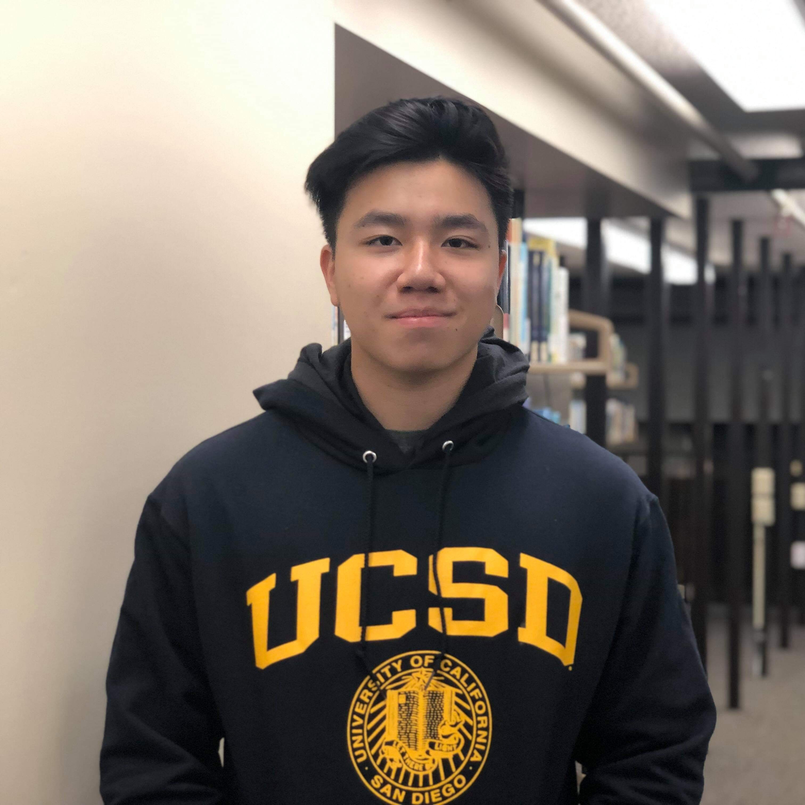

# Ryan Bui [ [About Me](#about-me) | [Projects](#projects) | [Tech](#technologies) ]

## Studying **Computer Science** at UCSD (_2019-2023_)
> "It always seems impossible until it's done." - Nelson Mandela 

### About Me
I am an aspiring ~~programmer~~ software engineer with a passion for learning new skills within the computer science world.

### Technologies
- Java
- Python
- C/C++
- MongoDB
- HTML/CSS
- JavaScript
  - React.js
  - Node.js
  - Express.js

### Projects
- [Key Conservation](https://github.com/ryanbuui/key-conservation-be) - Backend for a mobile app that connects Non-Profit Organizations with skilled workers
- [ClockWork](https://github.com/ryanbuui/ClockWork) - A chrome extension that allows for users to create simple todo lists with timers
- [Distribution Web App](https://github.com/TritonSE/distribution-web-app) - A web app for Feeding San Diego that organizes and records their distributions 

### Current Todo List
- [x] Finish my Week 1 tasks
- [ ] Finish my current project
- [ ] Learn about User Authentication

### My Most Used Terminal Commands
```
gdb
git reset
git stash
```

### [Click here to see my hobbies](HobbiesList.md)
